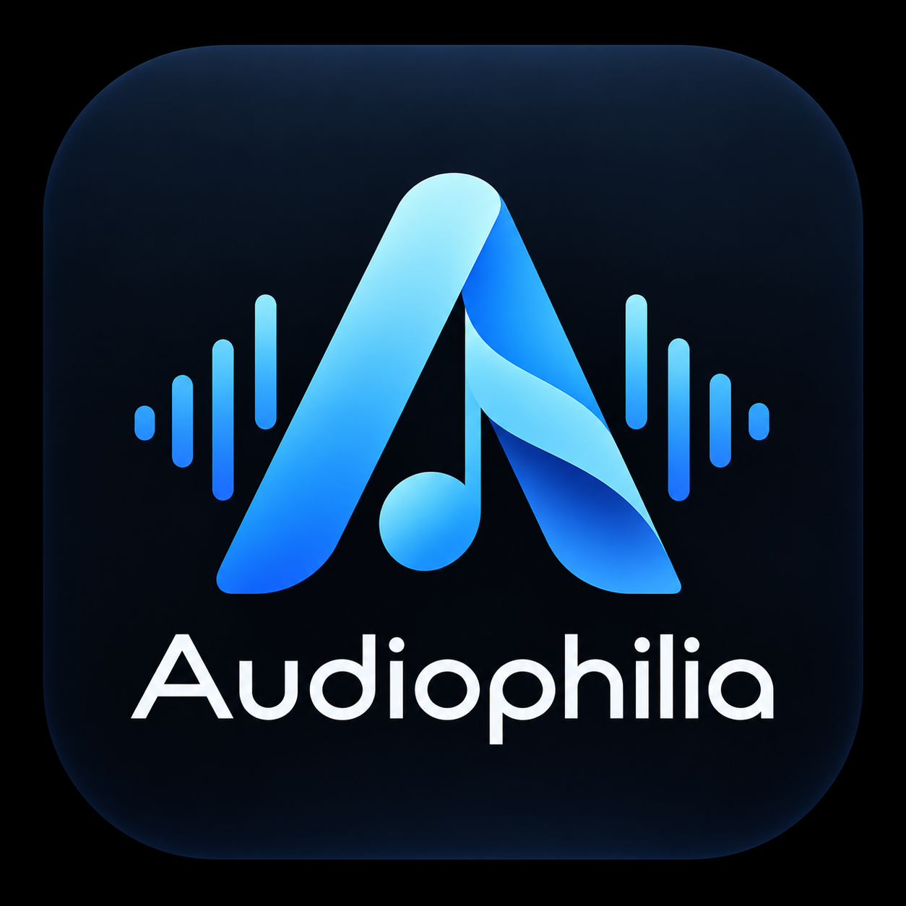

<div align="center">
  
  <h1>AudioPhillia</h1>
  <p><strong>A beautifully crafted, LAN-only personal music streaming application.</strong></p>
</div>

---

## 🎵 About AudioPhillia

**AudioPhillia** is a complete personal music streaming ecosystem engineered to stream high-fidelity audio (FLAC, M4A, Opus, WAV, MP4, MP3, AAC, OGG) directly from your local PC to your mobile device over Wi-Fi. 

Designed with modern, vibrant aesthetics and smooth micro-animations, AudioPhillia provides a premium listening experience without the need for an internet connection.

> [!IMPORTANT]
> **Zero Cloud Dependencies:** Requires **NO** Internet connection, cloud storage, Firebase, Supabase, Spotify API, or external web services. Your music, your network, your rules.

## 👥 Developers

AudioPhillia is actively developed and maintained by:
- **[Tharun](https://github.com/tharun-1605)**
- **[Dharaneesh](https://github.com/Dharaneesh20)**

---

## 🏗️ System Architecture

```
┌─────────────────────────────────────────────────────────────┐
│                 Flutter Mobile Application                  │
│       (Android Target / Riverpod / just_audio Player)       │
└──────────────────────────────┬──────────────────────────────┘
                               │ HTTP REST API & Range Audio Stream
                               ▼
┌─────────────────────────────────────────────────────────────┐
│                    Python FastAPI Backend                   │
│               (Listening on 0.0.0.0:8000)                   │
├─────────────────┬───────────────────┬───────────────────────┤
│ SQLite Database │  Mutagen Scanner  │ HTTP Range Streamer   │
│  (Indexed Meta) │ (Recursive Scan)  │ (206 Partial Content) │
└─────────────────┴─────────┬─────────┴───────────────────────┘
                            │ Read-Only Access
                            ▼
┌─────────────────────────────────────────────────────────────┐
│                 External HDD Music Library                  │
└─────────────────────────────────────────────────────────────┘
```

---

## ⚡ Quick Start

### 1. Start the Backend Server (Linux PC)

```bash
cd backend
python3 -m venv .venv
source .venv/bin/activate
pip install -r requirements.txt
python3 run.py
```

The server will automatically start and listen at `http://0.0.0.0:8000`. It features **zero-conf mDNS** to automatically broadcast the server IP to the mobile app!

### 2. Verify Backend Health

Open in your browser or run:
```bash
curl http://localhost:8000/api/health
```

Expected output:
```json
{
  "status": "ok",
  "library": "/path/to/your/music"
}
```

---

## 📱 Flutter Mobile Application Setup

### Prerequisites
- Flutter SDK 3.5.0+
- Android Studio / Android Device on the same Wi-Fi Network

### Build & Run
```bash
cd mobile_app
flutter pub get
flutter run -d <your-android-device-or-emulator>
```

### Auto-Discovery & Settings
1. Open the **AudioPhillia** app on your phone.
2. The app uses `zeroconf` to **automatically discover** the backend server on your Wi-Fi network!
3. Alternatively, navigate to **Settings** and manually enter your PC's LAN IP if auto-discovery is blocked by your router.

---

## 🔒 Safety & Performance Features

- **Strict Read-Only HDD Access:** The backend opens music files exclusively in read binary (`rb`) mode. Your music library files will **NEVER** be renamed, modified, moved, or deleted.
- **Path Traversal Protection:** Validates canonical realpaths. Requests attempting path traversal outside the music folder are rejected (`403 Forbidden`).
- **HTTP 206 Partial Content Streaming:** Supports seeking and instant playback of large FLAC/WAV files without loading entire files into system RAM.
- **Embedded Artwork Caching:** Extracts album covers via Mutagen and caches them locally using MD5 hashes for lightning-fast UI rendering.
- **Persistent Mini-Player:** A premium, gesture-controlled mini-player with dynamic background progress seeking that hovers over all primary navigation tabs.

---

## 🧪 Running Automated Tests

### Backend Test Suite
```bash
cd backend
PYTHONPATH=. .venv/bin/pytest -v
```

### Flutter Test Suite
```bash
cd mobile_app
flutter test
```
